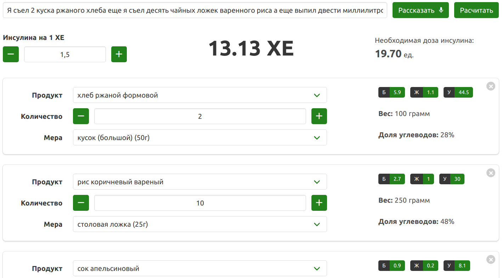

# CalculAid

Приложение позволяет рассказать ему, что Вы съели, на основе чего оно рассчитает количество [хлебных единиц](https://ru.wikipedia.org/wiki/%D0%A5%D0%BB%D0%B5%D0%B1%D0%BD%D0%B0%D1%8F_%D0%B5%D0%B4%D0%B8%D0%BD%D0%B8%D1%86%D0%B0) и необходимую дозу инсулина.



## Как это работает?
- Вы нажимаете кнопку и начинаете рассказывать, что съели. Важно - различные продукты должны быть разделены словом 'еще'. Например:<br/>
_Я съел 2 куска ржаного хлеба, **еще** я съел десять чайных ложек вареного риса, а **еще** выпил двести миллилитров апельсинного сока_.
- С помощью SpeechRecognition API Ваша речь переводится в текст.
- Текст отправляется на бэкенд, где происходит предобработка, определение частей речи и падежей (используются библиотеки `natural` и `mystem3`).
- На основе полученных данных слова относятся к одному из 3 типов: название продукта, количество или мера (граммы, литры и пр.).
- В базе с продуктами ищутся наилучшие совпадения с продуктами из речи. Для найденного продукта мера конвертируется в граммы.
- Массив с распознанными продуктами и количеством возвращается в бразуер, где отображается в интерфейсе, в котором можно подкорректировать данные, если что-то вдруг распозналось неправильно. Продукты в выпадающем списке отсортированы от наиболее подходящего к менее подходящему.

## Build Setup

``` bash
# install dependencies
$ npm install # Or yarn install

# serve with hot reload at localhost:3000
$ npm run dev

# build for production and launch server
$ npm run build
$ npm start

# generate static project
$ npm run generate
```

For detailed explanation on how things work, checkout the [Nuxt.js docs](https://github.com/nuxt/nuxt.js).

